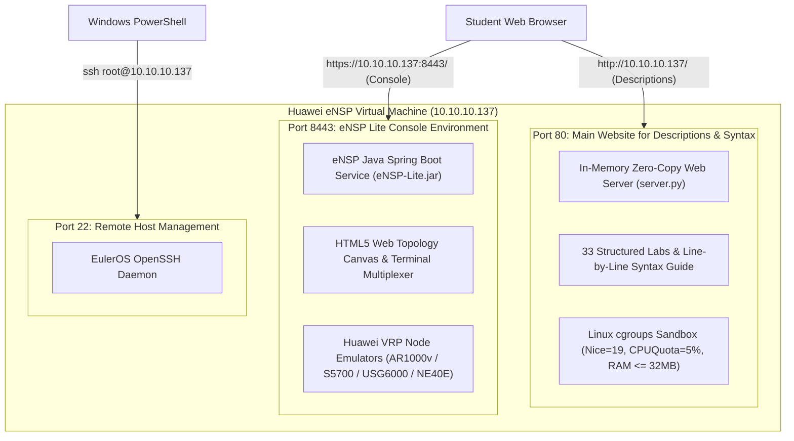
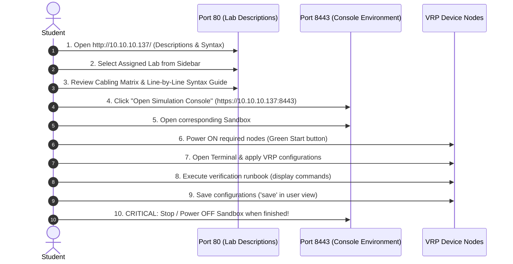

# Huawei Enterprise Datacom Lab Infrastructure
## Comprehensive Architecture, Student Guide & Administrator Manual

**Co-Branded Edition:** Computer Engineering Students Society (COESS)  
**Author:** Ranilo John Delos Angeles  
**Infrastructure Version:** Huawei eNSP Lite 2026 Enterprise Edition  

---

## 1. Quick Access & Port Allocation Summary

The virtual infrastructure operates on a **dual-port architecture** separating lab documentation from live network simulation:

| Port | Service | Purpose | URL / Access Method |
| :--- | :--- | :--- | :--- |
| **`80`** | **Main Lab Portal** | **Main website for lab descriptions**, scenario objectives, interface/IP addressing tables, copyable VRP scripts, and line-by-line CCNA-style syntax breakdowns. | **`http://10.10.10.137/`** |
| **`8443`** | **eNSP Lite Console** | **Live simulation environment** containing the HTML5 topology canvas, interactive wiring, device power controls, and web CLI terminals. | **`https://10.10.10.137:8443/`** |
| **`22`** | **EulerOS Linux SSH** | Remote administrative shell access to the host virtual machine via PowerShell or terminal. | **`ssh root@10.10.10.137`** |



---

## 2. How to SSH via Windows PowerShell

Students and instructors can access the backend EulerOS operating system directly from Windows PowerShell using the pre-configured root credentials.

### Step 1: Open Windows PowerShell
Press `Win + X` and select **Terminal** or **Windows PowerShell**.

### Step 2: Run the SSH Command
Type the following command and press `Enter`:

```powershell
ssh root@10.10.10.137
```

*(Optional: If connecting for the first time or after a VM reset, you can bypass host key prompts with:)*
```powershell
ssh -o StrictHostKeyChecking=no root@10.10.10.137
```

### Step 3: Enter the Password
When prompted for `root@10.10.10.137's password:`, enter:
```text
ensp2026@ensp
```
*(Note: Characters will not display on screen while typing the password in PowerShell. Just type `ensp2026@ensp` and press `Enter`.)*

### Example PowerShell Session Output:
```powershell
PS C:\Users\Student> ssh root@10.10.10.137
root@10.10.10.137's password:

Authorized users only. All activities may be monitored and reported.
Welcome to Huawei EulerOS (eNSP Lite Enterprise Edition)

[root@ensp ~]# systemctl status huawei-lab-portal.service
● huawei-lab-portal.service - Huawei Datacom Student Lab Portal
     Active: active (running)
```

---

## 3. System Credentials & Reference Summary

| Component | Endpoint | Username | Password | Notes |
| :--- | :--- | :--- | :--- | :--- |
| **Lab Portal (Port 80)** | `http://10.10.10.137/` | *(None)* | *(None)* | Open access for all students |
| **Console Env (Port 8443)** | `https://10.10.10.137:8443/` | *(No auth patch)* | *(None)* | Direct simulation canvas access |
| **VM OS Root SSH (Port 22)** | `10.10.10.137:22` | **`root`** | **`ensp2026@ensp`** | Host administrative shell |
| **VRP Device AAA** | Console / Telnet / SSH | **`admin`** | **`admin`** | Privilege Level 15 (Manager) |
| **VRP Super Password** | Privilege Elevation | **`super`** | **`super`** | Privilege Level 15 Elevation |

---

## 4. Recommended Virtual Machine (VM) & Host Settings

Configure the VM in VMware Workstation, VirtualBox, or Proxmox as follows:

| Setting | Minimum Specification | Recommended Specification | Notes |
| :--- | :--- | :--- | :--- |
| **vCPUs** | 4 Cores | **8 Cores** | 1:1 physical core mapping is ideal |
| **Virtualization Engine** | **VT-x / AMD-V Enabled** | **Nested VT-x/AMD-V + VMX Enabled** | **Mandatory** for QEMU/KVM VRP hardware acceleration |
| **RAM (Memory)** | 8 GB | **16 GB** | Accommodates multi-node topologies (e.g., Figure 4-7) |
| **Virtual Disk** | 40 GB (Thin Provisioned) | **60 GB (SSD)** | Fast container image and state loading |
| **Network Adapter** | Bridged or Host-Only | **Host-Only (`10.10.10.0/24`) or Bridged** | Static IP `10.10.10.137` configured on `eth0` |

> [!IMPORTANT]
> **Nested Virtualization is Mandatory:**  
> In your hypervisor settings (e.g. VMware Workstation -> *VM Settings* -> *Processors*), ensure **"Virtualize Intel VT-x/EPT or AMD-V/RVI"** is checked. If this is disabled, VRP virtual router containers cannot boot!

---

## 5. Student User Guide: Step-by-Step Workflow



### Step 1: Open the Lab Portal (`http://10.10.10.137/`)
* Use the **Theme Switcher** (Sun/Moon icon in top right) to toggle between Huawei Light and Dark modes.
* Use the **Search Bar** in the left sidebar to quickly find labs by topic (e.g., `OSPF`, `VLAN`, `VRRP`, `NAT`, `ACL`).

### Step 2: Study the Lab Blueprint
Before touching the CLI, review the five structured tabs:
1. **Overview & Setup:** Problem statement and default credentials.
2. **Interface & IP Matrix:** Port interconnections, IP subnets, and VLAN memberships.
3. **Task Objectives:** Step-by-step checklist of requirements.
4. **VRP Configuration & Detailed Syntax Breakdown:** 
   * Review the exact Huawei VRP commands for each device.
   * Read the **Line-by-Line Mechanism Breakdown** table to understand *why* each command is used and how it maps to Cisco CCNA / RFC standards.
   * Click **"Copy Script"** to copy clean configuration blocks.
5. **Verification Runbook:** Expected `display` verification commands.

### Step 3: Launch eNSP Lite Console (`https://10.10.10.137:8443/`)
1. Click **"Open Simulation Console"** or navigate directly to `https://10.10.10.137:8443`.
2. Find your lab sandbox (e.g., `Lab 01 Huawei DHCP Global Pool and Easy IP NAT` or `Enterprise HQ and WAN Figure 4-7`).
3. Click to open the topology canvas.

### Step 4: Power On Nodes & Configure
1. Click the **Start / Power On** button on the devices needed for your active lab.
2. Double-click any device (or right-click -> *CLI*) to open the web terminal.
3. Apply configurations, test ping connectivity, and execute verification commands.
4. Before finishing, save your work in VRP User View:
   ```text
   <Huawei> save
   Are you sure to continue? (y/n)[n]: y
   ```

---

## 6. Critical Resource Hygiene: Stopping Labs When Finished

> [!CAUTION]
> **Always Stop / Power Off Sandboxes When Done!**  
> Each active Huawei VRP node runs as an emulated virtual machine container consuming CPU cycles and ~1 GB of RAM.  
> If students leave multiple sandboxes running simultaneously, the VM's memory will be exhausted and nodes will become unresponsive.

### Mandatory Rules for Students:
1. **One Active Lab at a Time:** Only power on nodes for the specific lab you are actively working on.
2. **Graceful Node Shutdown:** When completing a lab session, click the **Stop All Nodes** (red square) button on the canvas or stop the sandbox from the Sandbox Management page.
3. **Do Not Spam Power Cycles:** Allow 10–15 seconds for virtual network interfaces and VRP daemons to initialize during boot.

---

## 7. Administrator Commands Reference

```bash
# Check status of the portal service (Port 80)
systemctl status huawei-lab-portal.service

# Restart the portal service
systemctl restart huawei-lab-portal.service

# Check real-time resource utilization
ps -eo pid,user,%cpu,%mem,rss,cmd | grep "[s]erver.py"

# Gracefully shut down the entire VM
shutdown -h now
```
