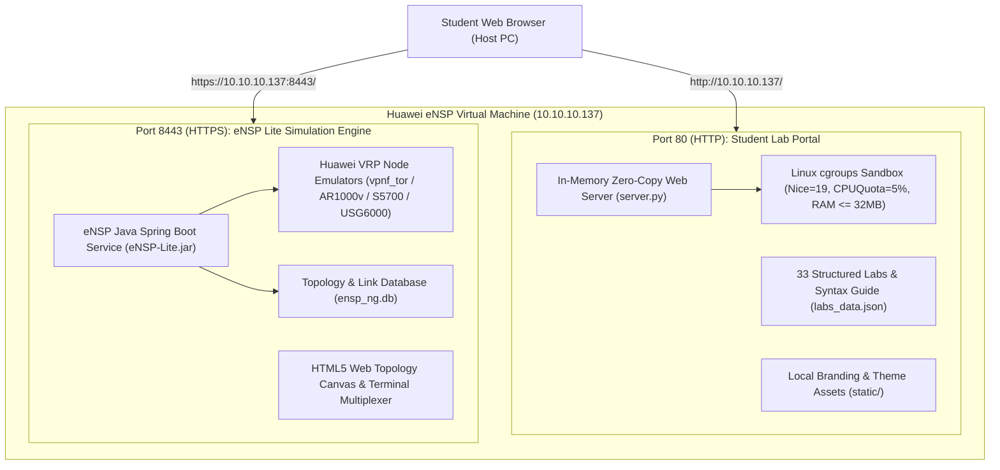
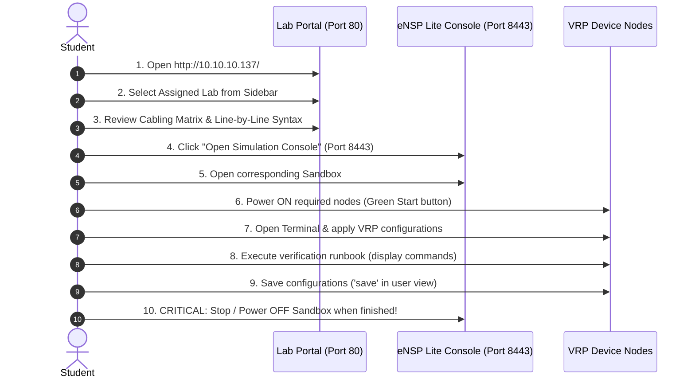

# Huawei Enterprise Datacom Lab Infrastructure
## Comprehensive Architecture, Student Guide & Administrator Manual

**Co-Branded Edition:** Computer Engineering Students Society (COESS)  
**Author:** Ranilo John Delos Angeles  
**Infrastructure Version:** Huawei eNSP Lite 2026 Enterprise Edition  

---

## 1. System Architecture & How It Is Built

The virtual infrastructure is engineered as a **self-contained, dual-tier Linux environment** running on EulerOS. It isolates high-performance network device emulation from student curriculum delivery to guarantee zero resource contention.



### Key Architectural Pillars:

1. **Dual-Port Isolation Model:**
   * **Port 80 (`http://<VM-IP>/`):** Dedicated **Huawei Enterprise Lab Portal** serving the entire 33-lab curriculum, complete interface/IP addressing tables, task checklists, copyable VRP scripts, and line-by-line CCNA-style syntax explanations.
   * **Port 8443 (`https://<VM-IP>:8443/`):** Official **Huawei eNSP Lite Console** running the simulation engine, Docker containers, and live VRP CLI nodes.

2. **Clean Canvas SQLite Injection:**
   * All 32 standardized CCNA-to-Huawei practice labs plus the **Featured Figure 4-7 Enterprise HQ & WAN** topology are pre-created, pre-placed, and pre-cabled in SQLite (`ensp_ng_project`, `ensp_ng_node`, `ensp_ng_link`).
   * Bulky on-canvas textboxes were removed to provide a clean, distraction-free canvas for students.

3. **100% Self-Contained Local Assets (Export-Ready):**
   * All images, logos (Huawei official eNSP raster and COESS emblem), stylesheets, scripts, and JSON syllabus files are stored locally in `/opt/huawei_lab_portal/`.
   * **No internet connection is required** for the portal or the simulation engine to function.

4. **Zero-Resource In-Memory Server:**
   * The portal server runs on an in-memory pre-compressed Gzip buffer engine using **~21 MB RAM** (<0.13% of system memory) and **0.0% idle CPU**.
   * Linux kernel scheduling priority `Nice=19` and cgroups hardware limits (`CPUQuota=5%`, `MemoryMax=32M`) ensure the portal never degrades network device emulation.

---

## 2. Recommended Virtual Machine (VM) & Host Settings

To ensure optimal performance and responsiveness when students power on multiple virtual routers, switches, and firewalls, configure the VM in VMware Workstation, VirtualBox, or Proxmox as follows:

| Setting | Minimum Specification | Recommended Specification | Notes |
| :--- | :--- | :--- | :--- |
| **vCPUs** | 4 Cores | **8 Cores** | 1:1 physical core mapping is ideal |
| **Virtualization Engine** | **VT-x / AMD-V Enabled** | **Nested VT-x/AMD-V + VMX Enabled** | **Mandatory** for QEMU/KVM VRP hardware acceleration |
| **RAM (Memory)** | 8 GB | **16 GB** | Accommodates multi-node topologies (e.g., Figure 4-7) |
| **Virtual Disk** | 40 GB (Thin Provisioned) | **60 GB (SSD)** | Fast container image and state loading |
| **Network Adapter** | Bridged or Host-Only | **Host-Only (`10.10.10.0/24`) or Bridged** | Static IP `10.10.10.137` configured on `eth0` |

> [!IMPORTANT]
> **Nested Virtualization is Mandatory:**  
> In your hypervisor settings (e.g. VMware Workstation -> *VM Settings* -> *Processors*), ensure **"Virtualize Intel VT-x/EPT or AMD-V/RVI"** is checked. If this is disabled, VRP virtual router containers cannot boot!

---

## 3. Student User Guide: Step-by-Step Workflow



### Step 1: Open the Lab Portal
Open your web browser and navigate to:
```
http://10.10.10.137/
```
* Use the **Theme Switcher** (Sun/Moon icon in top right) to toggle between Huawei Light and Dark modes.
* Use the **Search Bar** in the left sidebar to quickly find labs by topic (e.g., `OSPF`, `VLAN`, `VRRP`, `NAT`, `ACL`).

### Step 2: Study the Lab Blueprint
Before touching the CLI, review the five structured tabs:
1. **Overview & Setup:** Understand the real-world network problem statement and default credentials.
2. **Interface & IP Matrix:** Note all port interconnections, IP subnets, and VLAN memberships.
3. **Task Objectives:** Review the step-by-step checklist of requirements.
4. **VRP Configuration & Detailed Syntax Breakdown:** 
   * Review the exact Huawei VRP commands for each device.
   * Read the **Line-by-Line Mechanism Breakdown** table to understand *why* each command is used and how it maps to Cisco CCNA / RFC standards.
   * Click **"Copy Script"** to copy clean configuration blocks.
5. **Verification Runbook:** Review the expected `display` verification commands.

### Step 3: Launch eNSP Lite Simulation Environment
1. Click **"Open Simulation Console"** or go to `https://10.10.10.137:8443`.
2. Find your lab sandbox (e.g., `Lab 01 Huawei DHCP Global Pool and Easy IP NAT` or `Enterprise HQ and WAN Figure 4-7`).
3. Click to open the topology canvas.

### Step 4: Power On Nodes & Configure
1. Click the **Start / Power On** button on the devices needed for your active lab.
2. Double-click any device (or right-click -> *CLI*) to open the web terminal.
3. Apply configurations, test ping connectivity, and execute verification commands.
4. Before finishing, save your work in VRP User View:
   ```text
   <Huawei> save
   Are you sure to continue? (y/n)[n]: y
   ```

---

## 4. Critical Resource Hygiene: Stopping Labs When Finished

> [!CAUTION]
> **Always Stop / Power Off Sandboxes When Done!**  
> Each active Huawei VRP node runs as an emulated virtual machine container consuming CPU cycles and ~1 GB of RAM.  
> If students leave multiple sandboxes running simultaneously, the VM's memory will be exhausted and nodes will become unresponsive.

### Mandatory Rules for Students:
1. **One Active Lab at a Time:** Only power on nodes for the specific lab you are actively working on.
2. **Graceful Node Shutdown:** When completing a lab session, click the **Stop All Nodes** (red square) button on the canvas or stop the sandbox from the Sandbox Management page.
3. **Do Not Spam Power Cycles:** Allow 10–15 seconds for virtual network interfaces and VRP daemons to initialize during boot.

---

## 5. System Credentials & Reference Summary

### Default Management & Console Credentials

| Component | Endpoint | Username | Password | Notes |
| :--- | :--- | :--- | :--- | :--- |
| **Lab Portal** | `http://10.10.10.137/` | *(None required)* | *(None)* | Open access |
| **eNSP Lite Console** | `https://10.10.10.137:8443/` | *(No auth patch)* | *(None)* | Direct canvas access |
| **VRP Device AAA** | Console / Telnet / SSH | `admin` | `admin` | Level 15 Manager |
| **VRP Super Password** | Privilege Elevation | `super` | `super` | Level 15 Elevation |
| **VM OS Root SSH** | `10.10.10.137:22` | `root` | `ensp2026@ensp` | Admin SSH login |

### Administrator Service Commands

```bash
# Check status of the portal service
systemctl status huawei-lab-portal.service

# Restart the portal service
systemctl restart huawei-lab-portal.service

# Check real-time resource utilization
ps -eo pid,user,%cpu,%mem,rss,cmd | grep "[s]erver.py"

# Gracefully shut down the entire VM
shutdown -h now
```

---

## 6. VM Export & Distribution Instructions

The VM is 100% self-contained and ready to be distributed to students as an OVA/OVF template:

1. In the VM console, shut down gracefully:
   ```bash
   shutdown -h now
   ```
2. In VMware Workstation / ESXi:
   * Select the VM -> **File** -> **Export to OVF...** (or Export to OVA).
3. Distribute the `.ova` file to students with instructions to import into VMware Workstation 17 Pro / Player and ensure Nested VT-x is enabled.
